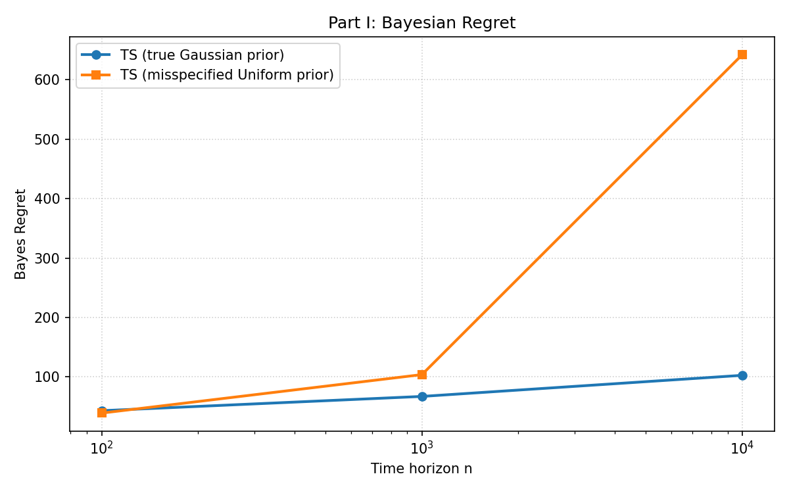
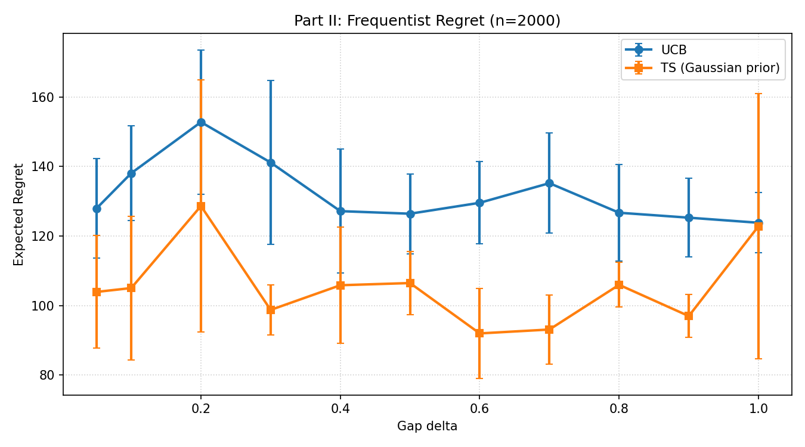

# Homework 4 Report

## Empirical Analysis of Multi-Armed Bandit Algorithms

### Setup

I implemented all experiments in `Homework-4/hw4_bandit_analysis.py` using NumPy and matplotlib with a fixed random seed (`SEED = 42`) for reproducibility.

The assignment has two parts:

1. **Part I (Bayesian regret):** Thompson Sampling (TS) under:
   - well-specified prior $ \mathcal{N}(0, I_K) $,
   - misspecified prior $ \mathrm{Uniform}([-1,1]^K) $.
2. **Part II (Frequentist regret):** comparison between:
   - UCB,
   - Thompson Sampling with Gaussian prior (`N(0,1)` per arm).

All rewards are Gaussian with unit variance.

---

## Part I: Bayesian Regret

### Problem setting

- Number of arms: $K = 10$
- Prior over task means: $ \mu \sim \mathcal{N}(0_K, I_K) $
- Reward model for each arm $i$: $ r_t(i) \sim \mathcal{N}(\mu_i, 1) $
- Time horizons: $n \in \{100,1000,10000\}$
- Independent simulations per horizon: `50`

At each simulation, I first sample a new environment mean vector `mu` from the true prior, then run the algorithm and compute cumulative regret.

### Posterior sampling rules

#### 1) TS with well-specified Gaussian prior

For arm $i$, prior and likelihood are:

$$
\mu_i \sim \mathcal{N}(0,1), \qquad r \mid \mu_i \sim \mathcal{N}(\mu_i,1).
$$

After $N_i$ pulls and reward sum $S_i$, posterior is:

$$
\mu_i \mid \mathcal{D} \sim \mathcal{N}\!\left(\frac{S_i}{1+N_i}, \frac{1}{1+N_i}\right).
$$

TS step:
- sample $\theta_i$ from each posterior,
- choose $a_t = \arg\max_i \theta_i$.

#### 2) TS with misspecified uniform prior

Assumed prior:

$$
\mu_i \sim \mathrm{Uniform}([-1,1]).
$$

With Gaussian likelihood, posterior density is proportional to:

$$
\mathbf{1}_{[-1,1]}(\mu_i)\exp\!\left(-\frac{N_i}{2}(\mu_i-\bar{x}_i)^2\right),
$$

where $ \bar{x}_i = S_i/N_i $ for $N_i>0$.  
This is a **truncated normal** centered at $\bar{x}_i$ with scale $1/\sqrt{N_i}$ on $[-1,1]$.  
I sample from this posterior using rejection sampling.

### Results

From the run:

- TS (true prior): `[43.27, 67.28, 102.76]`
- TS (misspecified prior): `[39.24, 103.98, 641.92]`

for horizons `n = [100, 1000, 10000]`.

### Discussion

- At small horizon ($n=100$), misspecified TS is still competitive and even slightly better in this run.
- As horizon grows, misspecification hurts significantly.
- At $n=10000$, regret under misspecified prior is much larger, showing that persistent prior mismatch can dominate long-run performance.
- Therefore, Bayes regret under misspecified prior is **not consistently competitive** with the correctly specified prior, especially at larger `n`.

---

## Part II: Frequentist Regret (UCB vs TS)

### Problem setting

- Arms: $K = 10$
- Means:
  - $\mu_1 = 0.5$ (optimal),
  - $\mu_2 = 0.5 - \Delta$,
  - $\mu_3, \ldots, \mu_{10} = -0.5$
- Reward variance for all arms: $1$
- Horizon: $n = 2000$
- Gap values: $\Delta \in \{0.05, 0.1, 0.2, \ldots, 1.0\}$
- Simulations per delta and algorithm: `10`

Regret is pseudo-regret:

$$
\sum_{t=1}^{n}\left(\mu^\star - \mu_{a_t}\right),
$$

where $\mu^\star = 0.5$.

### Algorithms

- **UCB:** pull each arm once, then choose

$$
\arg\max_i \left(\hat{\mu}_i + \sqrt{\frac{2\log t}{N_i}}\right).
$$

- **TS (Gaussian prior):** same posterior rule as Part I well-specified case with prior $ \mathcal{N}(0,1) $ per arm.

### Results

Empirical average regrets across `delta`:

- UCB: `[127.89, 138.06, 152.76, 141.13, 127.14, 126.40, 129.54, 135.19, 126.68, 125.26, 123.80]`
- TS: `[103.90, 105.01, 128.62, 98.72, 105.82, 106.45, 91.96, 93.08, 105.94, 96.95, 122.80]`

### Discussion

- TS has lower regret than UCB for most gap values in this experiment.
- The performance gap is moderate but consistent in favor of TS.
- Error bars are small (10 simulations), indicating stable estimates for this setup.
- This supports the view that TS can perform well even in frequentist environments where no true prior over tasks is assumed.

---

## Conclusion

The experiments show two key points:

1. **Prior quality matters for Bayesian regret:** misspecified priors can lead to much worse long-horizon behavior.
2. **TS is strong in frequentist settings:** in this 10-armed Gaussian instance, TS generally outperformed UCB in empirical regret.

Generated figures:

- `Homework-4/output/part1_bayes_regret.png`
- `Homework-4/output/part2_frequentist_regret.png`
